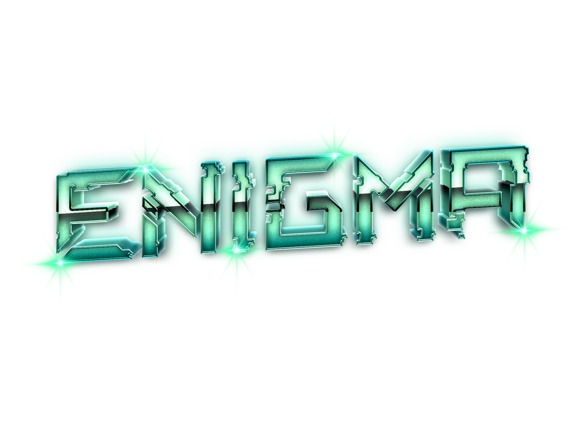

  

<h1 align="center">
  
    Reverse Prompt Engineering Event
  
</h1>

### 💻 Organized by The IT Department Symposium
**Chennai Institute Of Technology 🎓**

 

  
  &nbsp;
  
  &nbsp;
  

 

---

### 🧠 About The Event

<pre>
<code>> INITIATING "ENIGMA" PROTOCOL...</code> 
<b>ENIGMA</b> challenged participants to step into the shoes of the AI.
Instead of writing prompts to generate results, participants were presented with the final output and had to <b>reverse-engineer the original source prompt</b>.

</pre>

---

 

### 📸 Event Highlights

  

